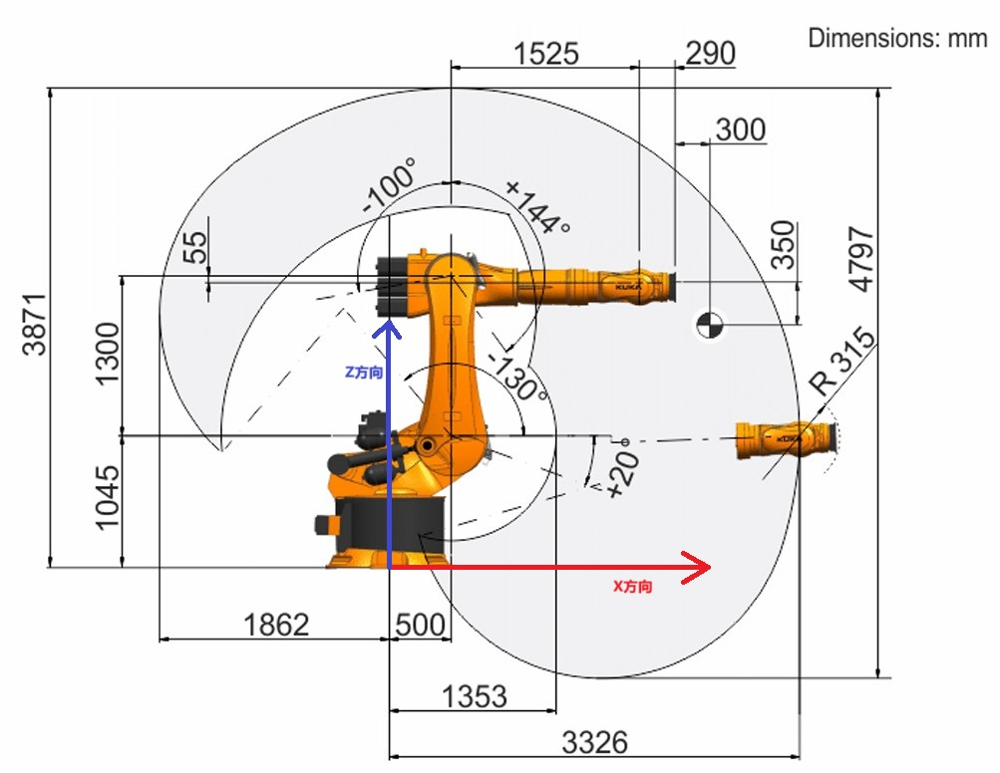
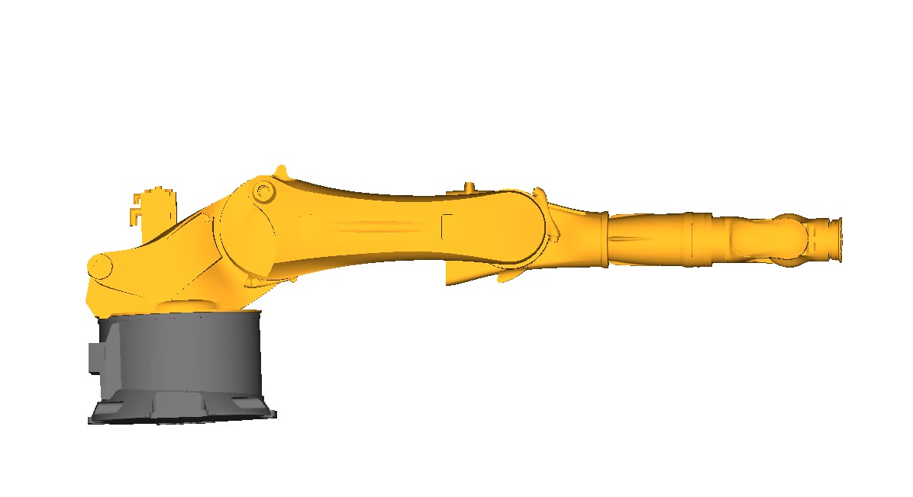

# OPW (Ortho-parallel Basis and a Spherical Wrist) 参数说明

算法假设当所有关节都直立向上时，机械臂处于零位，如下图中所示。它还假设所有绕机器人基座的旋转都是正向的。


要使用该库，填写 OPW 参数，其中包含7个运动学参数，以及将算法假设的零位（臂在Z轴向上）调整到制造商机器臂零位的关节偏移量。此外，如果机器人的关节旋转轴与论文中的约定不匹配，还应指定6个“符号校正”参数（-1或1）。

以下面的 KR480 R3330 MT机器人为例：



KUKA公司规定的机械臂零位如图所示：



厂家定义的关节1旋转正方向是绕z轴的负向；关节4、6的旋转正方向是绕x轴的反方向。
关节2的算法零位在制造商零位系统里面是-90度，那么关节2的零位修正参数就是 -90°（算法零位在制造商零位系统的值减去该值等于0），其他参数如下：

```python
c1 = 1.045
c2 = 1.3
c3 = 1.525
c4 = 0.29
a1 = 0.5
a2 = 0.055
b = 0

offset[1] = -90 # 第二个关节的零位修正量
sign[0] = -1
sing[3] = -1
sign[5] = -1
```

注意参数a1和a2的正负，顺着箭头方向如果x坐标增大就是正数，反之是负数；参数b类似；参数c不可能是负数。

在 OPW 算法里面，用 $q_{opw}$ 表示假设的零位和旋转轴向系统下机器人关节的位置，用 $q_{manufacturer}$表示厂家规定的机器人关节，两者的关系是：

$$q_{opw} = q_{manufacturer} \cdot sign - offset \implies q_{manufacturer} = (q_{opw} + offset) \cdot sign$$

充分理解上述原理，有助于计算各个参数的正负号。